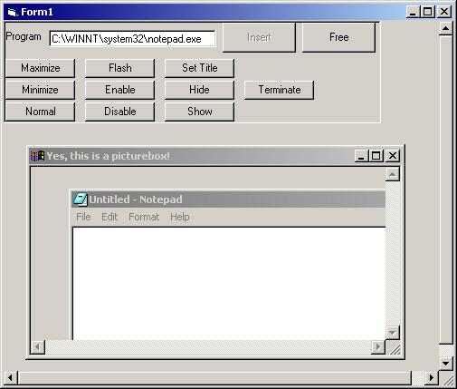



## Win in Win in Win

### Description

Make a non-mdi child window, and inside of that insert a whole other program, so... a window in a window in a window... this is not my code, its code from a number of sites.. www.vb-helper.com, allapi.net, freevbcode.com, pscode.com, elitespy, a bit here and there, thanks everyone, and if this helps you than feel free to either vote or just go to those sites.
 
### More Info
 

             |
---                |---
**Submitted On**   |2003-07-24 04:36:02
**By**             |[George E\.](https://github.com/Planet-Source-Code/PSCIndex/blob/master/ByAuthor/george-e.md)
**Level**          |Beginner
**User Rating**    |4.8 (19 globes from 4 users)
**Compatibility**  |VB 6\.0
**Category**       |[Windows API Call/ Explanation](https://github.com/Planet-Source-Code/PSCIndex/blob/master/ByCategory/windows-api-call-explanation__1-39.md)
**World**          |[Visual Basic](https://github.com/Planet-Source-Code/PSCIndex/blob/master/ByWorld/visual-basic.md)
**Archive File**   |[Win\_in\_Win1619427242003\.zip](https://github.com/Planet-Source-Code/george-e-win-in-win-in-win__1-47141/archive/master.zip)

